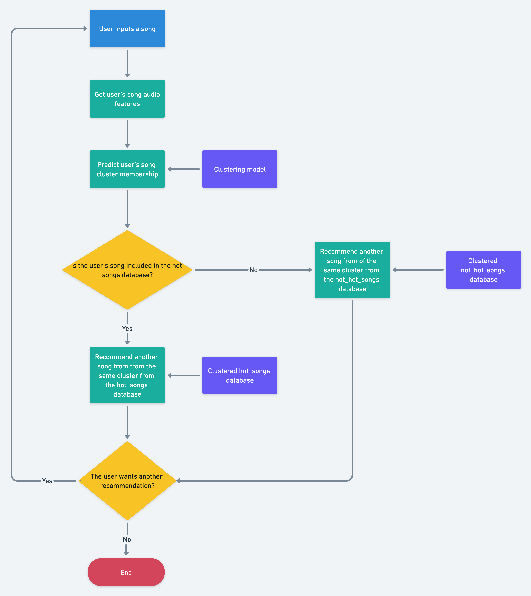

# Song Recommender

This repository is used to recommend songs from an input name

## Overview

I created a song recommender based on the features of the songs. It does the modeling of the data and assigns a cluster number to each song. It is also able to give a new cluster number to each new song. From there it can recommend other songs also depending on the 100-hot-songs list. It follows the schematic that can be found on the end of this document

## Contents

- Notebooks
1. `src/1.get_song_lists.ipynb` - Used to get the songs lists and find the song features for each list
2. `src/2.clustering_songs.ipynb` - Clustered the songs using 2 different models: K-means and BDSCAN
3. `src/3.song_recomender.ipynb` - Created the song recommender step by step
4. `src/4.song_recomender_function.ipynb` - Created the function "user friendly"

- Libraries
1. `src/spoty_jzar.py` - This is the class that is used as a Spotify interface
2. `src/music_jzar.py` - this lib is used to scrap and get the raw lists
3. `src/cluster_jzar.py` - this lib is used for clustering functions

## Databases

- I used a scrapper to get the 100 hot songs from 
- For the big dataset I used https://www.kaggle.com/datasets/rodolfofigueroa/spotify-12m-songs

## Requirements

- beautifulsoup4==4.10.0
- matplotlib==3.3.4
- numpy==1.19.5
- pandas==1.4.1
- requests==2.25.1
- scikit_learn==1.0.2
- scipy==1.6.0
- seaborn==0.11.2
- spotipy==2.19.0
- streamlit==1.8.0

## Schema

This is the schematic of the song recommender

